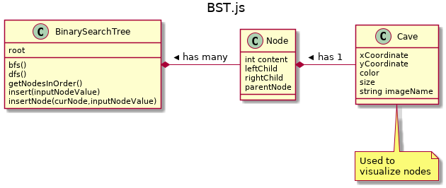
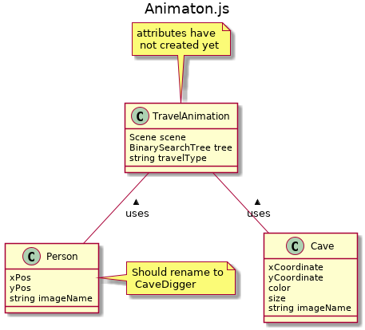

# Table of Contents

1.  [UML](#org6b28882)
    1.  [BST.js](#org3b3c501)
    2.  [Animaton](#org6f69415)
2.  [Files](#orge1703a5)

# UML

Note these are just my plans which are open to changing.

Some of these attributes have not been created yet

## BST.js

I propose we make a new class to store cave attributes like size and color

 When we initialize the node we need to set the size, xy positions etc. I
think we will add more attributes should they be stored in it's own object

## Animaton

Node \*- Cave : has 1 >

# Files

-   Scene1.js
    this stores thing onlynnecessary for the first level of thebgame
-   Animation.js
    Holds everything for moving the player

-   Cave
    Holds cave object holds xy coordinates, color and any visual aspects of the
-   Player
    (I think it should be renamed)
     Our customer needs a cave digger,  This is the sprite that travels from cave to cave.

-   BST
    The binary search tree is the backend. It holds the nodes and links between them.
    It has no visble properties becuae tjose are stored in the Cave object

